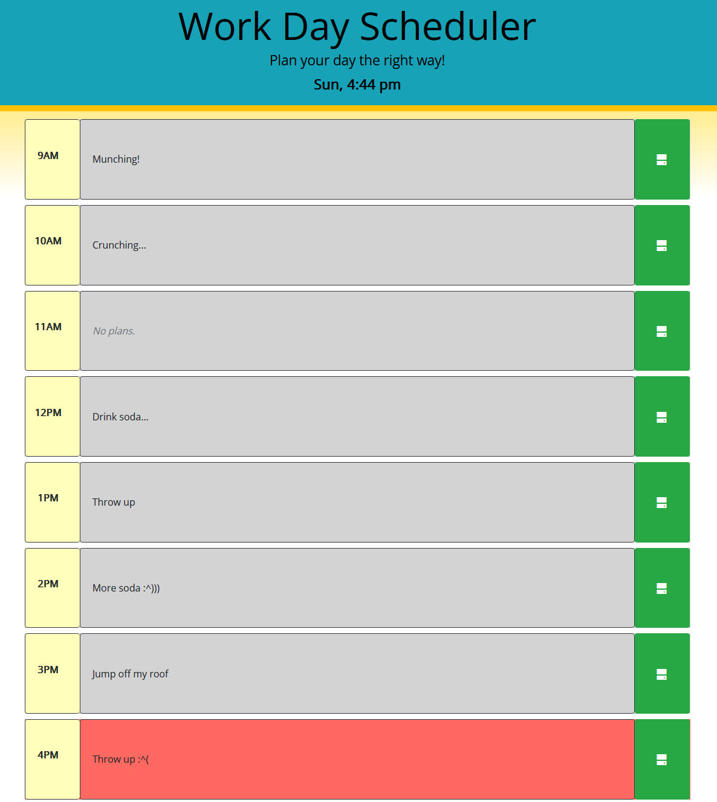

# Work Day Scheduler
## Dan Brackenbury
### Assembled with CSS, HTML, and Javascript, with the help of jQuery, jQueryUI, Bootstrap, Moment.js, and OpenIconic libraries.

Built off the starter code available [here.](https://github.com/coding-boot-camp/super-disco)

A day planner that allows you to set up daily plans and track your progress on them, as well as how they relate to the current time of day.
Also supports a calendar which allows you to make plans for days to come, as well as view old plans for days that have already gone.

Live deployment available at: https://helpvisa.github.io/work_scheduler_05challenge_scs/

